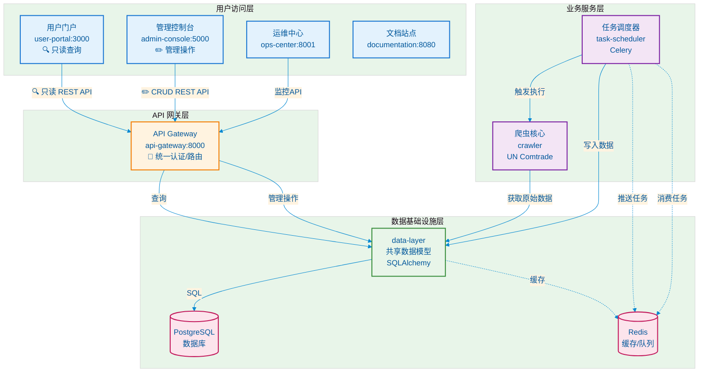
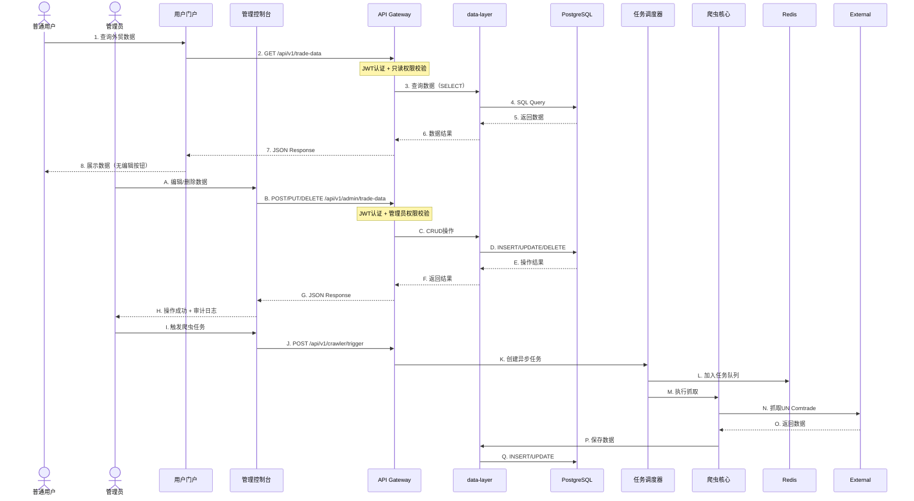

# 手机维修配件外贸数据管理系统

一个完整的手机维修配件外贸出货数据管理平台，支持数据采集、任务调度、权限管理和数据可视化分析。

## 系统架构

### 架构图



### 分层说明

| 层级 | 组件 | 职责 | 数据权限 |
|------|------|------|---------|
| **用户访问层** | user-portal<br>admin-console<br>ops-center<br>documentation | 用户门户（React）<br>管理后台（Flask-Admin）<br>运维监控<br>项目文档 | 只读查询<br>完整CRUD<br>监控查询<br>静态文档 |
| **API 网关层** | api-gateway | 统一入口、JWT认证、权限校验、路由<br>所有前端请求的统一接入点 | 权限控制代理 |
| **业务服务层** | task-scheduler<br>crawler | 异步任务调度（Celery）<br>UN Comtrade数据抓取 | 后台写入权限 |
| **数据基础设施层** | data-layer<br>PostgreSQL<br>Redis | 共享ORM模型<br>主数据库<br>缓存/任务队列 | 数据持久化 |


### 核心流程



## 目录结构

```
phone-parts-trade-system/
├── docker-compose.yml          # Docker编排配置
├── README.md                   # 项目文档
├── .env.example               # 环境变量模板
│
├── crawler/                   # 爬虫核心
│   ├── mobile_phone_spare_parts_crawler.py
│   └── 手机维修配件外贸出货数据.csv
│
├── data-layer/                # 数据层 (共享组件) ⭐
│   ├── data_layer/            # Python包
│   │   ├── __init__.py
│   │   ├── database.py        # 数据库连接
│   │   └── models/            # 共享数据模型
│   │       ├── user.py        # 用户模型（bcrypt加密）
│   │       ├── trade_data.py  # 外贸数据
│   │       ├── crawler_script.py  # 爬虫脚本
│   │       ├── crawler_task.py    # 爬虫任务
│   │       └── audit_log.py       # 审计日志
│   ├── init.sql               # 数据库初始化
│   ├── setup.py               # Python包配置
│   ├── Dockerfile             # 基础镜像
│   └── requirements.txt
│
├── api-gateway/               # API网关 (FastAPI)
│   ├── app/
│   │   ├── api/              # 路由层
│   │   ├── core/             # 核心配置（JWT认证）
│   │   ├── schemas/          # 数据校验
│   │   ├── services/         # 业务逻辑
│   │   ├── database.py       # (从data-layer导入)
│   │   └── main.py
│   ├── Dockerfile            # 基于data-layer构建
│   └── requirements.txt
│
├── task-scheduler/            # 任务调度 (Celery)
│   ├── app/
│   │   ├── crawler_adapter.py # UN Comtrade API适配器
│   │   ├── tasks.py           # Celery任务定义
│   │   └── worker.py          # Worker配置
│   ├── Dockerfile            # 基于data-layer构建
│   └── requirements.txt
│
├── user-portal/               # 用户门户 (React + Ant Design)
│   ├── src/
│   │   ├── pages/            # 页面组件
│   │   │   └── TradeData.tsx # 外贸数据查询（只读）
│   │   ├── components/       # 公共组件
│   │   └── App.tsx           # 路由配置
│   ├── Dockerfile
│   └── package.json
│
├── admin-console/             # 管理控制台 (Flask-Admin)
│   ├── app/
│   │   ├── main.py           # 主应用（含仪表盘）
│   │   └── templates/        # 报表模板
│   │       └── admin/
│   │           └── report_dashboard.html
│   ├── Dockerfile            # 基于data-layer构建
│   └── requirements.txt
│
├── ops-center/                # 运维中心 (FastAPI)
│   ├── app/
│   │   └── main.py
│   ├── Dockerfile            # 基于data-layer构建
│   └── requirements.txt
│
└── documentation/             # 文档站点 (MkDocs)
    ├── docs/                 # 文档源文件
    ├── mkdocs.yml           # 站点配置
    └── Dockerfile
```

## 组件说明

### data-layer/ - 数据层 ⭐核心组件

**设计哲学**: 统一数据访问，避免代码重复

```python
# 使用示例
from data_layer import TradeData, get_db_session

# 任意服务都可以这样访问数据
with get_db_session() as db:
    data = db.query(TradeData).filter_by(year=2024).all()
```

**包含内容**:
- 数据库连接池 (`database.py`)
- 5个核心模型 (`models/`)
- 基础CRUD操作
- **bcrypt密码加密**（替代passlib，解决72字节限制）

**优势**:
- ✅ 模型定义一处维护
- ✅ 强制数据一致性
- ✅ 作为Docker基础镜像复用

### 其他组件

| 组件 | 技术栈 | 基于data-layer | 端口 | 职责 | 认证方式 |
|------|--------|----------------|------|------|---------|
| api-gateway | FastAPI | ✅ | 8000 | 统一API入口、权限校验 | JWT Token |
| task-scheduler | Celery + Beat | ✅ | - | 异步任务调度 | 内部调用 |
| admin-console | Flask-Admin | ❌ | 5000 | 管理后台UI（调用API Gateway） | Session + JWT |
| ops-center | FastAPI | ✅ | 8001 | 运维监控API | Internal |
| user-portal | React 18 | ❌ | 3000 | 用户门户UI（调用API Gateway） | JWT Token |
| documentation | MkDocs Material | ❌ | 8080 | 静态文档站点 | - |

## 核心功能特性

### 1. 外贸数据管理
- **多维度查询**: 按年份、HS编码、贸易伙伴、状态筛选
- **数据导出**: 支持CSV格式导出
- **权限分级**: 
  - 管理员：完整CRUD权限
  - 普通用户：只读访问
- **状态管理**: 待确认/已确认双态机制

### 2. 爬虫任务调度
- **可视化脚本管理**: 在Admin Console管理爬虫脚本
- **异步任务队列**: Celery + Redis处理后台任务
- **实时状态跟踪**: 任务状态、进度、日志实时展示
- **数据源**: UN Comtrade API（851762、851770等HS编码）

### 3. 数据统计报表
- **集成仪表盘**: 嵌入Flask-Admin框架的统计视图
- **可视化图表**: Chart.js绘制年份趋势、HS编码分布
- **关键指标**: 总记录数、出口总额、数据状态分布
- **Top排名**: 主要贸易伙伴排行榜

### 4. 安全与审计
- **统一API入口**: 所有前端应用通过 API Gateway 访问数据
- **分层权限控制**: 
  - API Gateway: JWT Token认证 + 权限校验
  - Admin Console: Session认证（管理后台登录）
- **bcrypt加密**: 安全密码存储（替代passlib）
- **审计日志**: 记录所有数据变更和操作
- **操作追踪**: 谁在什么时间做了什么操作

## 快速开始

### 环境要求

- Docker >= 20.0
- Docker Compose >= 2.0
- 内存 >= 4GB
- 磁盘 >= 10GB

### 启动服务

```bash
# 1. 配置环境变量
cp .env.example .env

# 2. 构建基础镜像（先构建data-layer）
docker-compose build data-layer

# 3. 启动所有服务
docker-compose up -d

# 4. 等待数据库初始化完成（约30秒）
docker-compose logs -f data-layer

# 5. 创建管理员账户（首次运行）
docker-compose exec admin-console python -c "
from data_layer import get_db_session, User
from data_layer.models import UserRole
import bcrypt

db = get_db_session()
if not db.query(User).filter_by(username='admin').first():
    hashed = bcrypt.hashpw('admin123'.encode(), bcrypt.gensalt())
    admin = User(
        username='admin',
        email='admin@example.com',
        hashed_password=hashed.decode(),
        role=UserRole.ADMIN,
        is_active=True
    )
    db.add(admin)
    db.commit()
    print('管理员创建成功')
db.close()
"
```

### 访问服务

| 服务 | 地址 | 说明 | 默认凭证 |
|------|------|------|---------|
| 用户门户 | http://localhost:3000 | React前端（只读） | - |
| API文档 | http://localhost:8000/docs | Swagger UI | JWT Token |
| 管理控制台 | http://localhost:5000 | Flask Admin | admin / admin123 |
| 运维中心 | http://localhost:8001 | 监控API | - |
| 文档站点 | http://localhost:8080 | 项目文档 | - |

### 使用流程示例

#### 1. 数据采集（管理员）
```
登录 Admin Console → 调用 API Gateway → 创建爬虫任务 → 
Celery异步执行 → 数据自动入库 → 审核确认
```

#### 2. 数据查询（普通用户 - 只读）
```
打开 User Portal → 筛选条件（年份/HS编码/贸易伙伴）→ 
调用 API Gateway（JWT认证/只读权限）→ 
返回查询结果 → 查看数据列表（无编辑功能）→ 导出CSV
```

#### 3. 数据管理（管理员 - CRUD）
```
登录 Admin Console → 外贸数据管理 → 
调用 API Gateway（管理员权限校验）→ 
执行增删改查 → 自动记录审计日志 → 返回操作结果
```

#### 4. 数据分析（管理员）
```
Admin Console → 数据报表 → 调用 API Gateway 获取统计数据 → 
查看统计图表 → 分析年份趋势 → 查看主要贸易伙伴 → 导出报表
```

## 开发指南

### 添加新模型

1. 在 `data-layer/data_layer/models/` 创建模型
2. 导出到 `data_layer/models/__init__.py`
3. 重建镜像: `docker-compose build data-layer`
4. 重建依赖服务: `docker-compose up -d --build`

### 本地开发

```bash
# 安装数据层
pip install -e ./data-layer

# 启动API网关
cd api-gateway && uvicorn app.main:app --reload --port 8000

# 启动Celery Worker（新终端）
cd task-scheduler
celery -A app.worker worker --loglevel=info -Q default,crawler

# 启动Celery Beat（定时任务，新终端）
celery -A app.worker beat --loglevel=info
```

### 调试技巧

```bash
# 查看服务日志
docker-compose logs -f admin-console
docker-compose logs -f task-scheduler

# 进入容器调试
docker-compose exec admin-console bash
docker-compose exec postgres psql -U postgres -d phone_parts

# 查看Celery队列
docker-compose exec redis redis-cli LLEN celery
```

## 生产部署建议

### 1. 安全加固
- 修改所有默认密码
- 启用HTTPS（配置Nginx反向代理）
- 配置CORS白名单
- 设置JWT过期时间（建议1小时）

### 2. 性能优化
- PostgreSQL添加连接池（PgBouncer）
- Redis配置持久化
- Celery Worker根据CPU核心数扩展
- 启用API Gateway的GZip压缩

### 3. 监控告警
- 配置Prometheus + Grafana监控
- 设置Celery任务失败告警
- 监控数据库连接数和慢查询
- 配置日志聚合（ELK或Loki）

## 常见问题

### Q: Celery任务不执行？
A: 检查Worker是否监听`crawler`队列：
```bash
docker-compose exec task-scheduler celery -A app.worker inspect active
```

### Q: 用户门户显示空白？
A: 检查API Gateway是否可访问，以及CORS配置是否正确。

### Q: 数据库迁移失败？
A: 使用`docker-compose down -v`清除卷后重新启动，或手动执行ALTER TABLE。

### Q: 如何重置管理员密码？
A: 进入admin-console容器执行Python脚本重新哈希密码。

## 技术栈版本

| 组件 | 版本 |
|------|------|
| Python | 3.11 |
| FastAPI | 0.104+ |
| Flask-Admin | 1.6+ |
| Celery | 5.3+ |
| PostgreSQL | 15 |
| Redis | 7 |
| React | 18 |
| Node.js | 20 |

## 许可证

MIT License

---

**维护者**: Matrix Agent  
**最后更新**: 2026-03-17
