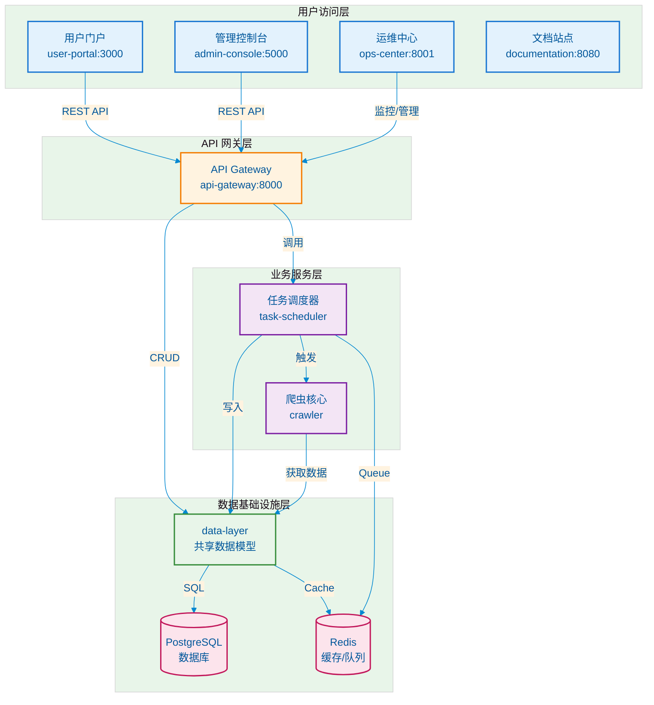
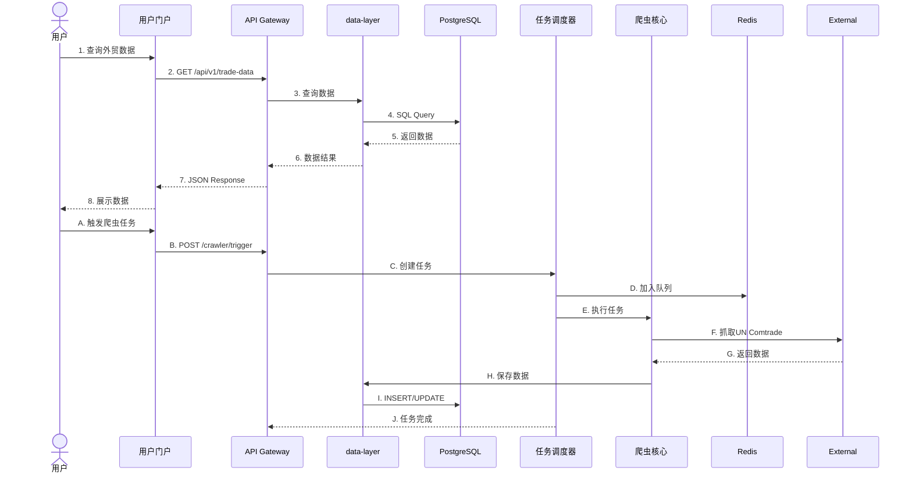

# 手机维修配件外贸数据管理系统

一个完整的手机维修配件外贸出货数据管理平台。

## 系统架构

### 架构图



### 分层说明

| 层级 | 组件 | 职责 |
|------|------|------|
| **用户访问层** | user-portal, admin-console, ops-center, documentation | 面向用户的交互界面 |
| **API 网关层** | api-gateway | 统一入口、认证、路由 |
| **业务服务层** | task-scheduler, crawler | 核心业务逻辑 |
| **数据基础设施层** | data-layer, PostgreSQL, Redis | 数据持久化与缓存 |


### 核心流程



## 目录结构

```
phone-parts-trade-system/
├── docker-compose.yml          # Docker编排配置
├── README.md                   # 项目文档
├── .env.example               # 环境变量模板
│
├── crawler/                   # 爬虫核心
│   ├── mobile_phone_spare_parts_crawler.py
│   └── 手机维修配件外贸出货数据.csv
│
├── data-layer/                # 数据层 (共享组件) ⭐
│   ├── data_layer/            # Python包
│   │   ├── __init__.py
│   │   ├── database.py        # 数据库连接
│   │   └── models/            # 共享数据模型
│   │       ├── user.py
│   │       ├── trade_data.py
│   │       ├── crawler_script.py
│   │       ├── crawler_task.py
│   │       └── audit_log.py
│   ├── init.sql               # 数据库初始化
│   ├── setup.py               # Python包配置
│   ├── Dockerfile             # 基础镜像
│   └── requirements.txt
│
├── api-gateway/               # API网关 (FastAPI)
│   ├── app/
│   │   ├── api/              # 路由层
│   │   ├── core/             # 核心配置
│   │   ├── schemas/          # 数据校验
│   │   ├── services/         # 业务逻辑
│   │   ├── database.py       # (从data-layer导入)
│   │   └── main.py
│   ├── Dockerfile            # 基于data-layer构建
│   └── requirements.txt
│
├── task-scheduler/            # 任务调度 (Celery)
│   ├── app/
│   │   ├── crawler_adapter.py
│   │   ├── tasks.py
│   │   └── worker.py
│   ├── Dockerfile            # 基于data-layer构建
│   └── requirements.txt
│
├── user-portal/               # 用户门户 (React)
│   ├── src/
│   ├── Dockerfile
│   └── package.json
│
├── admin-console/             # 管理控制台 (Flask-Admin)
│   ├── app/
│   │   └── main.py
│   ├── Dockerfile            # 基于data-layer构建
│   └── requirements.txt
│
├── ops-center/                # 运维中心 (FastAPI)
│   ├── app/
│   │   └── main.py
│   ├── Dockerfile            # 基于data-layer构建
│   └── requirements.txt
│
└── documentation/             # 文档站点 (MkDocs)
    └── docs/
```

## 组件说明

### data-layer/ - 数据层 ⭐核心组件

**设计哲学**: 统一数据访问，避免代码重复

```python
# 使用示例
from data_layer import TradeData, get_db_session

# 任意服务都可以这样访问数据
with get_db_session() as db:
    data = db.query(TradeData).filter_by(year=2024).all()
```

**包含内容**:
- 数据库连接池 (`database.py`)
- 5个核心模型 (`models/`)
- 基础CRUD操作

**优势**:
- ✅ 模型定义一处维护
- ✅ 强制数据一致性
- ✅ 作为Docker基础镜像复用

### 其他组件

| 组件 | 技术栈 | 基于data-layer | 端口 |
|------|--------|----------------|------|
| api-gateway | FastAPI | ✅ | 8000 |
| task-scheduler | Celery | ✅ | - |
| admin-console | Flask-Admin | ✅ | 5000 |
| ops-center | FastAPI | ✅ | 8001 |
| user-portal | React | ❌ (前端) | 3000 |
| documentation | MkDocs | ❌ (静态) | 8080 |

## 快速开始

### 环境要求

- Docker >= 20.0
- Docker Compose >= 2.0
- 内存 >= 4GB

### 启动服务

```bash
# 1. 配置环境变量
cp .env.example .env

# 2. 构建基础镜像（先构建data-layer）
docker-compose build data-layer

# 3. 启动所有服务
docker-compose up -d

# 4. 初始化管理员
docker-compose exec admin-console python -m app.main create-admin
```

### 访问服务

| 服务 | 地址 | 说明 |
|------|------|------|
| 用户门户 | http://localhost:3000 | React前端 |
| API文档 | http://localhost:8000/docs | Swagger UI |
| 管理控制台 | http://localhost:5000 | Flask Admin |
| 运维中心 | http://localhost:8001 | 监控API |
| 文档站点 | http://localhost:8080 | 项目文档 |

**默认账户**: admin / admin123

## 核心流程示例

### 1. 数据查询流程

```
用户 → user-portal → api-gateway → data-layer → PostgreSQL
                        ↓
                Redis (缓存)
```

### 2. 爬虫任务流程

```
用户触发 → api-gateway → task-scheduler → Redis Queue
                                        ↓
                                    Celery Worker
                                        ↓
                                    crawler → UN Comtrade API
                                        ↓
                                    data-layer → PostgreSQL
```

## 开发指南

### 添加新模型

1. 在 `data-layer/data_layer/models/` 创建模型
2. 导出到 `data_layer/models/__init__.py`
3. 重建镜像: `docker-compose build data-layer`
4. 重建依赖服务

### 本地开发

```bash
# 安装数据层
pip install -e ./data-layer

# 启动API网关
cd api-gateway && uvicorn app.main:app --reload
```

## 许可证

MIT License
